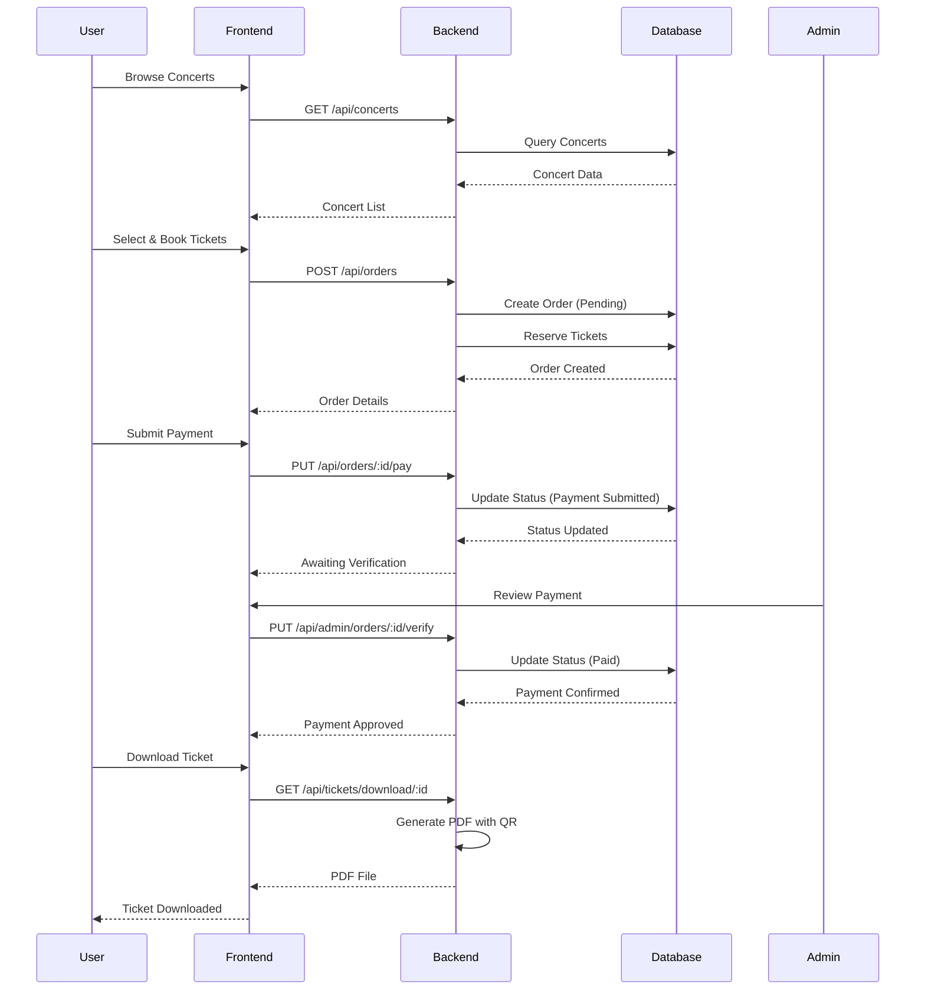

## 🎵 Overview

**Concert Ticketing System** adalah aplikasi web full-stack yang memungkinkan pengguna untuk membeli tiket konser secara online dengan sistem pembayaran manual dan verifikasi admin. Aplikasi ini dilengkapi dengan dashboard admin untuk manajemen konser, tiket, dan pesanan, serta fitur download tiket PDF otomatis setelah pembayaran dikonfirmasi.

> **Live Demo:** [View Demo](#) | **Source Code:** [GitHub Repository](#)

---

## ✨ Key Features

### 👥 User Features
- **Authentication System** - Registrasi dan login dengan JWT authentication
- **Browse Concerts** - Lihat daftar konser dengan filter dan search
- **Ticket Booking** - Pilih dan pesan berbagai jenis tiket
- **Payment Submission** - Submit pembayaran dengan berbagai metode
- **Order Tracking** - Lacak status pesanan real-time
- **PDF Ticket Download** - Download tiket dalam format PDF setelah konfirmasi

### 👨‍💼 Admin Features
- **Admin Dashboard** - Statistik lengkap penjualan dan revenue
- **Concert Management** - CRUD konser dan jenis tiket
- **User Management** - Kelola data pengguna dan roles
- **Payment Verification** - Verifikasi pembayaran manual dari customer
- **Sales Reports** - Laporan penjualan dengan filter tanggal dan konser
- **Ticket Type Management** - Atur harga dan ketersediaan tiket

---

## 🖼️ Screenshots

### User Interface

<!-- Carousel for User Screenshots -->
<div class="swiper user-screenshots">
  <div class="swiper-wrapper">
    <div class="swiper-slide">
      
      <p class="text-center mt-2">Homepage dengan Hero Section</p>
    </div>
    <div class="swiper-slide">
      
      <p class="text-center mt-2">Daftar Konser dengan Filter</p>
    </div>
    <div class="swiper-slide">
      
      <p class="text-center mt-2">Detail Konser & Pemilihan Tiket</p>
    </div>
    <div class="swiper-slide">
      
      <p class="text-center mt-2">Booking Confirmation Modal</p>
    </div>
    <div class="swiper-slide">
      
      <p class="text-center mt-2">Halaman Order Management</p>
    </div>
    <div class="swiper-slide">
      
      <p class="text-center mt-2">Detail Pesanan dengan Status</p>
    </div>
    <div class="swiper-slide">
      
      <p class="text-center mt-2">PDF Ticket dengan QR Code</p>
    </div>
  </div>
  <div class="swiper-pagination"></div>
  <div class="swiper-button-next"></div>
  <div class="swiper-button-prev"></div>
</div>

### Admin Dashboard

<!-- Carousel for Admin Screenshots -->
<div class="swiper admin-screenshots">
  <div class="swiper-wrapper">
    <div class="swiper-slide">
      
      <p class="text-center mt-2">Admin Dashboard Overview</p>
    </div>
    <div class="swiper-slide">
      
      <p class="text-center mt-2">Concert Management Panel</p>
    </div>
    <div class="swiper-slide">
      
      <p class="text-center mt-2">Ticket Type Configuration</p>
    </div>
    <div class="swiper-slide">
      
      <p class="text-center mt-2">Payment Verification System</p>
    </div>
    <div class="swiper-slide">
      
      <p class="text-center mt-2">User Management Interface</p>
    </div>
    <div class="swiper-slide">
      
      <p class="text-center mt-2">Sales Reports & Analytics</p>
    </div>
  </div>
  <div class="swiper-pagination"></div>
  <div class="swiper-button-next"></div>
  <div class="swiper-button-prev"></div>
</div>

---

## 🛠️ Tech Stack

### Backend
- **Framework:** Flask (Python 3.x)
- **Database:** MySQL 8.0
- **ORM:** SQLAlchemy
- **Authentication:** Flask-JWT-Extended
- **Password Hashing:** Werkzeug Security
- **PDF Generation:** ReportLab + QRCode
- **API Documentation:** RESTful API Design

### Frontend
- **Framework:** React 18.x + Vite
- **Styling:** TailwindCSS + DaisyUI
- **State Management:** React Context API
- **Routing:** React Router v6
- **HTTP Client:** Axios
- **Form Handling:** React Hooks
- **Notifications:** React Hot Toast
- **Icons:** React Icons (Heroicons)

### Development Tools
- **Version Control:** Git & GitHub
- **Package Manager:** npm (Frontend), pip (Backend)
- **Code Editor:** VS Code
- **API Testing:** Postman
- **Database Tool:** MySQL Workbench

---

## 📊 System Architecture

```
┌─────────────────────────────────────────────────────────────┐
│                      Client (Browser)                        │
│                    React + TailwindCSS                       │
└──────────────────────────┬──────────────────────────────────┘
                           │ HTTPS/REST API
                           │
┌──────────────────────────▼──────────────────────────────────┐
│                    Flask Backend API                         │
│  ┌──────────────┐  ┌──────────────┐  ┌──────────────┐     │
│  │     Auth     │  │   Concert    │  │    Order     │     │
│  │   Service    │  │   Service    │  │   Service    │     │
│  └──────────────┘  └──────────────┘  └──────────────┘     │
│                                                               │
│  ┌──────────────┐  ┌──────────────┐  ┌──────────────┐     │
│  │     JWT      │  │  SQLAlchemy  │  │   ReportLab  │     │
│  │    Handler   │  │     ORM      │  │ PDF Generator│     │
│  └──────────────┘  └──────────────┘  └──────────────┘     │
└──────────────────────────┬──────────────────────────────────┘
                           │
                           │
┌──────────────────────────▼──────────────────────────────────┐
│                      MySQL Database                          │
│   Users | Concerts | Tickets | Orders | OrderItems          │
└─────────────────────────────────────────────────────────────┘
```

---

## 🔄 Order Flow



---

## 🎯 Key Highlights

### 1. **Secure Authentication**
Implementasi JWT (JSON Web Token) untuk authentication yang aman dengan:
- Token-based authentication
- Protected routes dengan middleware
- Role-based access control (User & Admin)
- Password hashing dengan Werkzeug

```python
# Backend Auth Implementation
def admin_required(f):
    @wraps(f)
    def decorated_function(*args, **kwargs):
        verify_jwt_in_request()
        current_user_id_str = get_jwt_identity()
        current_user = User.query.get(int(current_user_id_str))
        
        if current_user.role != 'admin':
            return jsonify({'error': 'Admin access required'}), 403
            
        return f(current_user, *args, **kwargs)
    return decorated_function
```

### 2. **Payment Verification System**
Sistem pembayaran manual dengan workflow:
1. User membuat order → Status: **Pending**
2. User submit payment → Status: **Payment Submitted**
3. Admin verifikasi → Status: **Paid** atau **Cancelled**
4. User download ticket (jika Paid)

### 3. **PDF Ticket Generation**
Otomatis generate PDF ticket dengan:
- QR Code untuk validasi
- Detail lengkap konser dan tiket
- Multiple tickets dalam satu order
- Professional layout menggunakan ReportLab

```python
# PDF Generation dengan QR Code
qr_data = f"TICKET:{ticket_number}|ORDER:{order_id}|CONCERT:{concert_id}"
qr = qrcode.QRCode(version=1, box_size=10, border=5)
qr.add_data(qr_data)
qr.make(fit=True)
```

### 4. **Real-time Order Tracking**
User bisa tracking status order dengan 4 state:
- ⏳ **Pending Payment** - Menunggu pembayaran
- 🔍 **Awaiting Verification** - Menunggu verifikasi admin
- ✅ **Confirmed** - Pembayaran dikonfirmasi
- ❌ **Cancelled** - Dibatalkan (user/admin)

### 5. **Responsive Admin Dashboard**
Dashboard admin dengan:
- Real-time statistics (revenue, orders, users)
- Top selling concerts
- Payment verification queue
- Sales reports dengan export CSV
- User management

---

## 📁 Project Structure

```
concert-ticketing-system/
├── backend/
│   ├── app/
│   │   ├── __init__.py
│   │   ├── models/           # SQLAlchemy Models
│   │   │   ├── user.py
│   │   │   ├── concert.py
│   │   │   ├── ticket_type.py
│   │   │   ├── order.py
│   │   │   └── order_item.py
│   │   ├── routes/           # API Endpoints
│   │   │   ├── auth.py
│   │   │   ├── concerts.py
│   │   │   ├── orders.py
│   │   │   ├── tickets.py
│   │   │   └── admin.py
│   │   └── utils/            # Helpers
│   │       ├── auth.py
│   │       ├── helpers.py
│   │       └── pdf_generator.py
│   ├── config.py
│   ├── requirements.txt
│   └── run.py
│
├── frontend/
│   ├── src/
│   │   ├── components/       # React Components
│   │   │   ├── common/
│   │   │   └── debug/
│   │   ├── pages/            # Page Components
│   │   │   ├── Home.jsx
│   │   │   ├── Concerts.jsx
│   │   │   ├── ConcertDetail.jsx
│   │   │   ├── Orders.jsx
│   │   │   ├── Profile.jsx
│   │   │   └── admin/
│   │   ├── context/          # Context API
│   │   │   └── AuthContext.jsx
│   │   ├── services/         # API Services
│   │   │   ├── api.js
│   │   │   ├── auth.js
│   │   │   ├── concerts.js
│   │   │   ├── orders.js
│   │   │   └── admin.js
│   │   ├── utils/            # Utilities
│   │   │   └── helpers.js
│   │   ├── App.jsx
│   │   └── main.jsx
│   ├── package.json
│   └── vite.config.js
│
└── README.md
```

---

## 🚀 Installation & Setup

### Prerequisites
- Python 3.8+
- Node.js 16+
- MySQL 8.0+
- Git

### Backend Setup

```bash
# Clone repository
git clone https://github.com/yourusername/concert-ticketing.git
cd concert-ticketing/backend

# Create virtual environment
python -m venv venv
source venv/bin/activate  # Windows: venv\Scripts\activate

# Install dependencies
pip install -r requirements.txt

# Setup database
mysql -u root -p
CREATE DATABASE concert_app2;
exit;

# Configure environment
cp .env.example .env
# Edit .env with your database credentials

# Run migrations (if using Flask-Migrate)
flask db upgrade

# Run development server
python run.py
```

### Frontend Setup

```bash
# Navigate to frontend
cd ../frontend

# Install dependencies
npm install

# Configure environment
cp .env.example .env
# Edit .env with API URL

# Run development server
npm run dev
```

### Access the Application

- **Frontend:** http://localhost:5173
- **Backend API:** http://localhost:5001/api
- **Admin Login:** admin@example.com / password
- **User Login:** user@example.com / password

---

## 🎨 Design Decisions

### 1. **DaisyUI + TailwindCSS**
Menggunakan DaisyUI untuk component library yang consistent dan TailwindCSS untuk styling yang flexible dan maintainable.

### 2. **Context API vs Redux**
Memilih Context API karena state management relatif sederhana dan menghindari boilerplate Redux yang berlebihan.

### 3. **Manual Payment Verification**
Implementasi manual verification karena:
- Sesuai dengan use case lokal Indonesia
- Tidak perlu payment gateway integration
- Admin control lebih besar
- Cost-effective untuk MVP

### 4. **JWT Authentication**
JWT dipilih untuk:
- Stateless authentication
- Scalability yang lebih baik
- Mobile-ready architecture
- Cross-domain authentication

---

## 🔒 Security Features

- ✅ Password hashing dengan `pbkdf2:sha256`
- ✅ JWT token dengan expiration
- ✅ Protected routes dengan authentication middleware
- ✅ Role-based access control (RBAC)
- ✅ SQL injection prevention (SQLAlchemy ORM)
- ✅ XSS protection (React escaping)
- ✅ CORS configuration
- ✅ Input validation & sanitization

---

## 📈 Performance Optimizations

1. **Database Indexing** - Primary keys dan foreign keys
2. **Lazy Loading** - SQLAlchemy relationships
3. **Pagination** - Semua list endpoints
4. **React Optimization** - useCallback, useMemo hooks
5. **Asset Optimization** - Vite build optimization
6. **API Response Caching** - Cache strategi untuk static data

---

## 🐛 Challenges & Solutions

### Challenge 1: JWT Subject Type Error
**Problem:** Backend mengirim JWT dengan integer subject, frontend expect string.

**Solution:** 
```python
# Backend: Konversi user_id ke string saat create token
access_token = create_access_token(identity=str(user.user_id))
```

### Challenge 2: Ticket Availability Race Condition
**Problem:** Dua user booking simultan bisa overbook ticket.

**Solution:** Database transaction dengan row-level locking:
```python
ticket_type = TicketType.query.with_for_update().get(ticket_type_id)
if ticket_type.quantity_available < quantity:
    db.session.rollback()
    return error_response('Not enough tickets')
```

### Challenge 3: PDF Generation Performance
**Problem:** Generate PDF untuk multiple tickets lambat.

**Solution:** Optimize PDF generation dengan:
- Reusable templates
- Batch processing untuk multiple tickets
- Async generation (future improvement)

---

## 🔮 Future Enhancements

- [ ] Payment gateway integration (Midtrans/Xendit)
- [ ] Email notifications untuk status order
- [ ] WhatsApp notification integration
- [ ] Seat selection untuk tiket VIP
- [ ] Real-time ticket availability dengan WebSocket
- [ ] Mobile app dengan React Native
- [ ] Social media login (Google, Facebook)
- [ ] Referral & promo code system
- [ ] Advanced analytics dashboard
- [ ] Multi-language support

---

## 📝 Lessons Learned

1. **Proper state management** sangat penting untuk maintain consistency antara localStorage dan React state
2. **API error handling** harus comprehensive dengan user-friendly messages
3. **Payment workflow** perlu clear communication dengan user tentang setiap step
4. **Admin verification** memerlukan good UX untuk efisiensi
5. **PDF generation** memerlukan careful planning untuk layout dan performance

---

## 👨‍💻 Developer

**Rezka Wildan**  
Full Stack Developer

- 🌐 Website: [yourwebsite.com](#)
- 💼 LinkedIn: [your-linkedin](#)
- 📧 Email: rreska9@gmail.com
- 🐱 GitHub: [rezka08](#)

---

## 📄 License

This project is licensed under the MIT License - see the [LICENSE](LICENSE) file for details.

---

## 🙏 Acknowledgments

- Flask documentation
- React documentation
- TailwindCSS & DaisyUI teams
- ReportLab community
- All open source contributors

---

<div style="text-align: center; margin-top: 3rem; padding: 2rem; background: linear-gradient(135deg, #667eea 0%, #764ba2 100%); border-radius: 10px; color: white;">
  <h3>⭐ Interested in this project?</h3>
  <p>Feel free to star the repository and contribute!</p>
  <a href="#" style="display: inline-block; margin-top: 1rem; padding: 0.75rem 2rem; background: white; color: #667eea; text-decoration: none; border-radius: 5px; font-weight: bold;">
    View on GitHub
  </a>
</div>

<!-- Swiper CSS & JS for carousel -->
<link rel="stylesheet" href="https://cdn.jsdelivr.net/npm/swiper@8/swiper-bundle.min.css"/>
<script src="https://cdn.jsdelivr.net/npm/swiper@8/swiper-bundle.min.js"></script>

<script>
// Initialize Swiper for user screenshots
const userSwiper = new Swiper('.user-screenshots', {
  slidesPerView: 1,
  spaceBetween: 30,
  loop: true,
  pagination: {
    el: '.swiper-pagination',
    clickable: true,
  },
  navigation: {
    nextEl: '.swiper-button-next',
    prevEl: '.swiper-button-prev',
  },
  autoplay: {
    delay: 5000,
    disableOnInteraction: false,
  },
});

// Initialize Swiper for admin screenshots
const adminSwiper = new Swiper('.admin-screenshots', {
  slidesPerView: 1,
  spaceBetween: 30,
  loop: true,
  pagination: {
    el: '.swiper-pagination',
    clickable: true,
  },
  navigation: {
    nextEl: '.swiper-button-next',
    prevEl: '.swiper-button-prev',
  },
  autoplay: {
    delay: 5000,
    disableOnInteraction: false,
  },
});
</script>

<style>
.swiper {
  width: 100%;
  margin: 2rem 0;
  border-radius: 10px;
  box-shadow: 0 10px 30px rgba(0,0,0,0.1);
}

.swiper-slide {
  display: flex;
  flex-direction: column;
  align-items: center;
  padding: 1rem;
  background: #f8f9fa;
}

.swiper-slide img {
  width: 100%;
  max-width: 900px;
  height: auto;
  border-radius: 8px;
  box-shadow: 0 5px 15px rgba(0,0,0,0.2);
}

.swiper-button-next,
.swiper-button-prev {
  color: #667eea;
}

.swiper-pagination-bullet-active {
  background: #667eea;
}
</style>